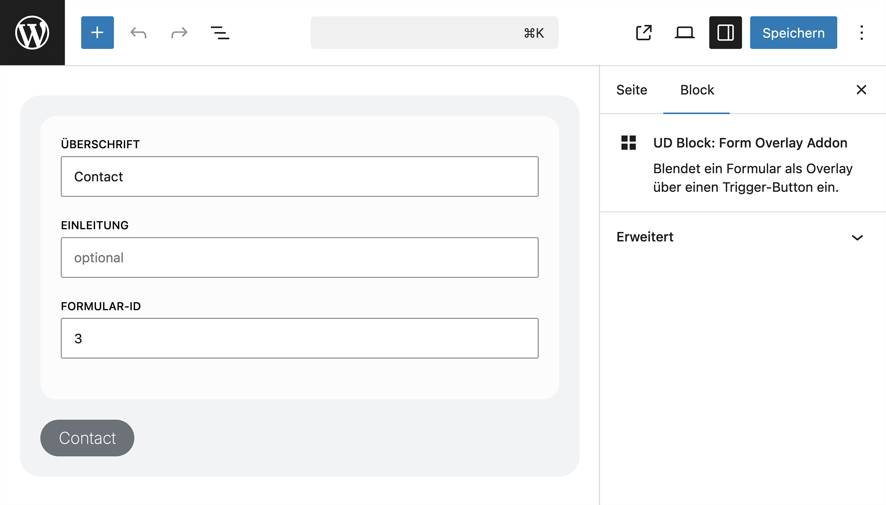
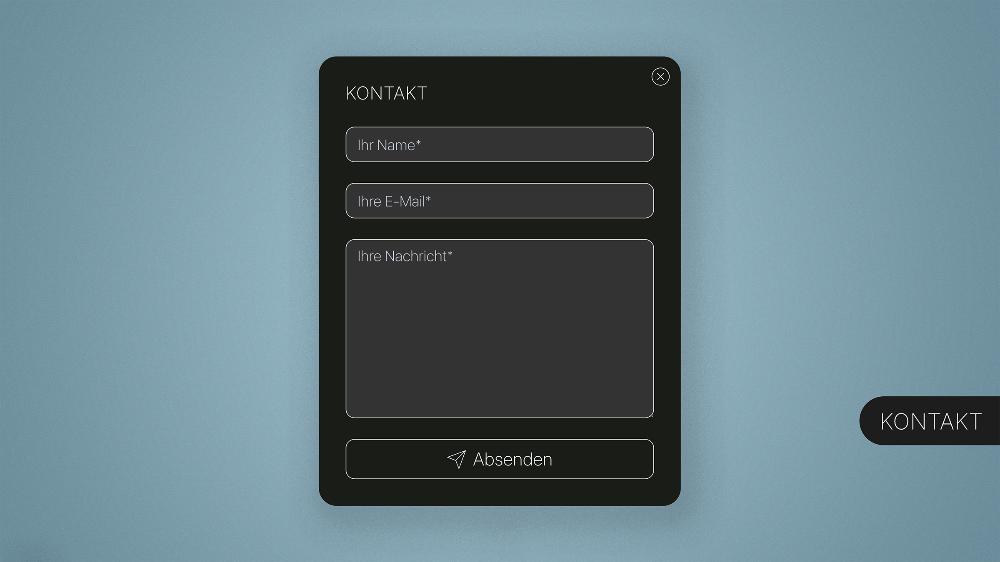

# UD Block: Form Overlay Addon

Blendet ein Formular als Overlay über einen Trigger-Button ein.

**Hinweis:** Der Block ist aktuell für **Fluent Forms** ausgelegt und benötigt eine gültige Formular-ID.

---

## Übersicht

Der Block erzeugt einen Button, der beim Klick ein Overlay öffnet. Darin wird ein Formular (z. B. Fluent Forms) geladen und angezeigt.

Optional können Titel und Einleitungstext im Overlay definiert werden.

---

## Funktionen

- Overlay-Panel mit Formular
- Trigger-Button frei beschriftbar
- Optionaler Titel und Introtext im Overlay
- Schliessen via:
  - Close-Button
  - Klick auf Hintergrund
  - Escape-Taste
- Mehrere Instanzen pro Seite möglich (unique IDs)
- Barrierearm (ARIA-Attribute vorhanden)

---

## Editor



Screenshot des Blocks im Editor mit Formular-Auswahl und Textfeldern.
Text kann direkt im Block bearbeitet werden (Button-Label, Titel, Intro).

---

## Einstellungen

### Formular

- **Form Type**
  Aktuell vorbereitet für Fluent Forms

- **Form ID**
  ID des Formulars (z. B. aus Fluent Forms)

---

### Inhalt

- **Button Label**
  Text des Trigger-Buttons

- **Panel Title** *(optional)*
  Titel im Overlay

- **Panel Intro** *(optional)*
  Einleitungstext oberhalb des Formulars

---

## Frontend



Beim Klick auf den Button öffnet sich ein modales Overlay mit dem Formular.

---

## Technische Hinweise

- Formular wird per Shortcode eingebunden:
  ```php
  [fluentform id="123"]
  ```
- **Andere Formular-Plugins werden aktuell nicht unterstützt**

- Ohne gesetzte Form-ID wird ein Hinweis ausgegeben

- Jeder Block erhält eine eigene Instanz-ID (keine Konflikte bei mehreren Overlays)

- Assets werden über `block.json` geladen

- Frontend-JS steuert:
  - Öffnen / Schliessen
  - ESC-Verhalten
  - Backdrop-Klick

---

## Voraussetzungen

- Installiertes und aktives **Fluent Forms** Plugin
- Vorhandenes Formular mit gültiger **Form-ID**

Ohne Fluent Forms kann der Block kein Formular anzeigen.

---

## Einblicke in die Umsetzung

Der Beitrag gibt Einblick in die entwickelte Lösung und ihre Funktionsweise.

- **Mehr zur Lösung:** [Kontaktformular in WordPress als Overlay öffnen](https://ulrich.digital/formular-als-overlay-in-wordpress-oeffnen/)

## Autor

[ulrich.digital gmbh](https://ulrich.digital)

## Lizenz

Dieses Projekt steht unter der [ulrich.digital Nutzungslizenz 1.0](LICENSE).

Die unveränderte Software darf in eigenen und kommerziellen Projekten eingesetzt werden. Auf jeder öffentlich erreichbaren Website oder Anwendung muss [ulrich.digital gmbh](https://ulrich.digital) im Impressum, in einem Credits-Bereich oder auf einer vergleichbaren Informationsseite genannt werden. Verkauf, eigenständige Weitergabe, Unterlizenzierung und Änderungen bedürfen der vorherigen schriftlichen Zustimmung von ulrich.digital gmbh.

Komponenten Dritter behalten ihre jeweiligen Lizenz- und Nutzungsbedingungen.
